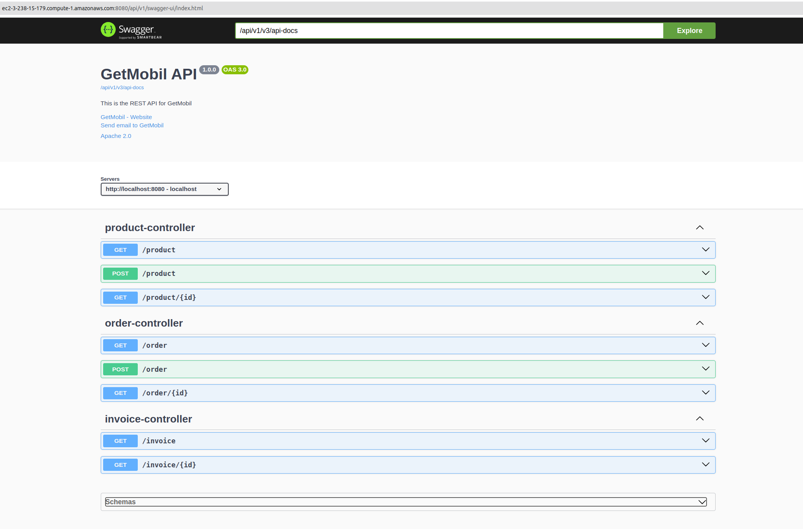
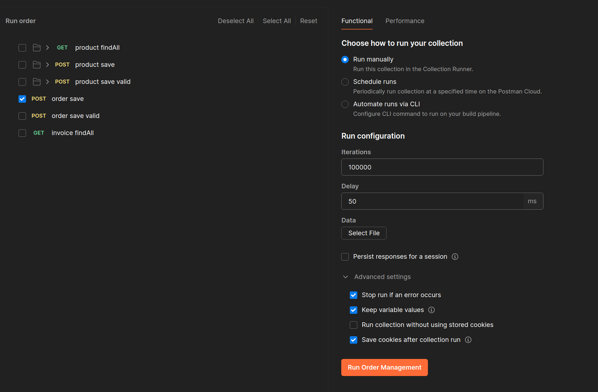
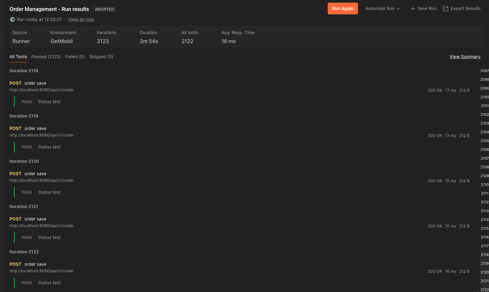
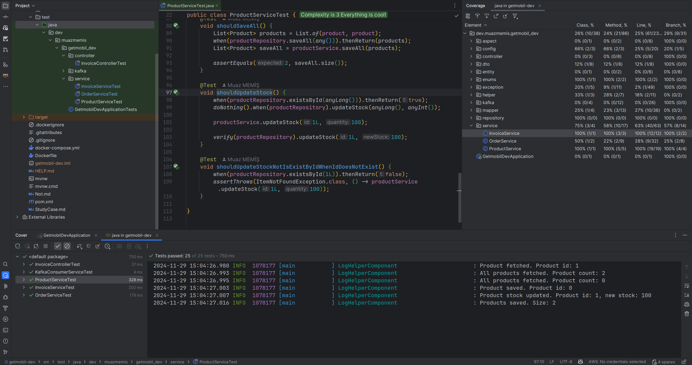

# GetMobil Study Case

## Deployment AWS EC2

- [Dockerfile](./Dockerfile)
- [Docker Image](https://hub.docker.com/repository/docker/muazmemis/getmobil)
- [Docker Compose](./docker-compose.yml)
- [AWS EC2 Instance - Api Doc](http://ec2-3-238-15-179.compute-1.amazonaws.com:8080/api/v1/swagger-ui/index.html)

## Postman 10.000 Request Test

- [Postman Collection](./GetMobil.postman_collection.json)

'

'

## Unit Test

'
